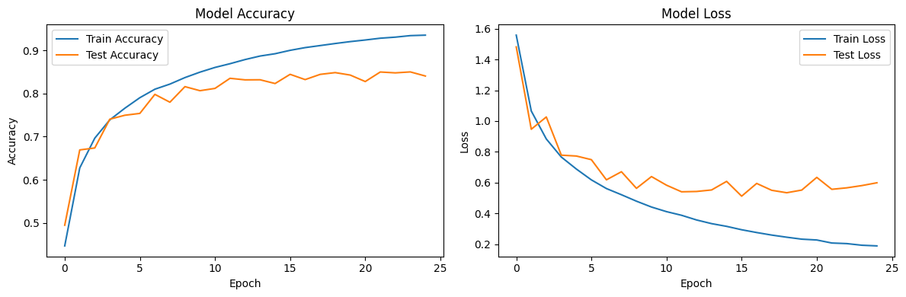

# cnn-pruning-distillation

Свёрточная сеть на CIFAR-10, её сжатие итеративным прунингом и попытка дистилляции в рекуррентного ученика.

[](https://colab.research.google.com/github/yoonzky/cnn-pruning-distillation/blob/main/cnn_cifar10.ipynb)
[](https://colab.research.google.com/github/yoonzky/cnn-pruning-distillation/blob/main/pruning_distillation.ipynb)

## cnn_cifar10.ipynb

Классификатор CIFAR-10: четыре блока Conv — BatchNorm — Conv — BatchNorm — MaxPool — Dropout с числом фильтров 32, 64, 128, 256 и картами 32x32, 16x16, 8x8, 4x4, дальше flatten и Dense. Adam, learning rate 0,001, 25 эпох, batch 64.

Результат — **84,04 %** на тестовом наборе (Colab, T4, около 10 секунд на эпоху).



После 15-й эпохи точность на тесте стоит на месте, а лосс на тесте начинает расти — сеть переобучается. Ранняя остановка дала бы то же качество почти вдвое быстрее.

## pruning_distillation.ipynb

Учитель — та же архитектура, обученная заново: **85,24 %** на тесте.

**Прунинг.** Пять итераций с растущим порогом: веса ниже порога обнуляются, затем одна эпоха дообучения (на последней итерации — пять).

| Порог | 0,05 | 0,10 | 0,15 | 0,20 | 0,25 |
| --- | --- | --- | --- | --- | --- |
| Точность | 85,29 % | 84,94 % | 76,80 % | 82,47 % | **82,81 %** |

Первые два шага качество не трогают. На третьем точность проваливается до 76,8 %: одной эпохи дообучения не хватает, чтобы сеть перестроилась. Дальше она восстанавливается, и после пяти эпох на последнем шаге итог — 82,8 %, на 2,4 пункта ниже учителя.

**Дистилляция.** Класс `Distiller` с температурой и двумя слагаемыми лосса; ученик — один слой LSTM плюс один Dense, картинка подаётся ему как 32 шага по 96 признаков, то есть построчно. Перебраны тридцать конфигураций: LSTM из 512, 256, 128, 64, 32, 16 и Dense из 128, 64, 32, 16, 10.

Основной ученик (LSTM 128) после дистилляции дал **58,88 %**. В переборе лучший — LSTM 512 с Dense 64, 54,86 %; четыре конфигурации (512/32, 512/16, 256/16, 128/16) выродились в предсказание одного класса, то есть в 10 %. Перебор учится 5 эпох против 25 у основного ученика, поэтому его максимум ниже.

Цель "ученик не хуже учителя" не достигнута: около 59 % против 85 %. Причина в самом ученике: читая картинку построчно, LSTM теряет пространственные связи, которые свёртка видит сразу.

## Запуск

```
pip install -r requirements.txt
jupyter notebook cnn_cifar10.ipynb
```

CIFAR-10 качается первой ячейкой с зеркала на Hugging Face и разбирается в тот же формат, что отдаёт `keras.datasets.cifar10.load_data()`: около 15 секунд вместо четверти часа с сайта Торонто. Запасной путь — оригинальный архив оттуда же. Файлы кладутся в `./cifar10_data` и при следующем запуске берутся с диска.

## Стек

Python, TensorFlow, Keras, NumPy, Pandas, Matplotlib, seaborn; pyarrow и Pillow — для чтения датасета.

Учебный проект курса «Введение в разработку систем искусственного интеллекта», СПбГЭТУ «ЛЭТИ», 2025.
